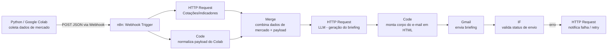

# Assistente de Investimentos com IA — RPA com n8n e Python

Projeto final do curso **"Uso de Webhooks e APIs no N8N" / "Criando um Processo de RPA com N8N e Python"** (trilha Santander — Automação com n8n, DIO).

Automação (RPA) que gera e envia por e-mail um **briefing diário de investimentos** usando IA, orquestrada em **n8n** e alimentada por um script **Python** (executável no Google Colab).

## Arquitetura



### Fluxo resumido

1. **Coleta (Python/Colab)** — `python/coleta_investimentos.py` busca cotações/indicadores (ou usa dados simulados) e dispara o webhook do n8n com um payload JSON contendo os ativos monitorados e o e-mail de destino.
2. **Webhook (n8n)** — recebe o payload e inicia o fluxo.
3. **HTTP Request** — busca dados complementares de mercado em uma API pública.
4. **Code** — normaliza e valida os dados recebidos do Colab (tratamento de erros/campos ausentes).
5. **Merge** — une os dois ramos (dados de mercado + payload do Colab) em um único objeto.
6. **HTTP Request (LLM)** — envia os dados consolidados para um modelo de linguagem (ex.: OpenAI API) para gerar o texto do briefing em linguagem natural.
7. **Code** — formata o briefing em HTML para o corpo do e-mail.
8. **Gmail** — envia o e-mail automaticamente para o destinatário configurado.
9. **IF + HTTP Request (fallback)** — valida se o envio teve sucesso; em caso de erro, aciona uma notificação/retry (tratamento de erro do fluxo).

## Estrutura do repositório

```
.
├── README.md
├── n8n/
│   └── workflow.json          # Workflow exportado do n8n, pronto para importar
├── python/
│   ├── coleta_investimentos.py # Script de coleta (Colab/local) que dispara o webhook
│   └── requirements.txt
└── .env.example                # Variáveis de ambiente necessárias
```

## Como executar

### 1. Importar o workflow no n8n
1. Abra sua instância do n8n.
2. Menu **⋮ → Import from File** e selecione `n8n/workflow.json`.
3. Configure as credenciais:
   - **Gmail** (OAuth2) para o node de envio.
   - **HTTP Header Auth** para a API de cotações e para a API do LLM (ex.: `Authorization: Bearer <token>`).
4. Ative o workflow e copie a URL do node **Webhook**.

### 2. Configurar o script Python
```bash
cd python
pip install -r requirements.txt
cp ../.env.example .env   # preencha com sua URL de webhook e e-mail de destino
python coleta_investimentos.py
```

No Google Colab, basta colar o conteúdo de `coleta_investimentos.py` em uma célula, definir as variáveis (`N8N_WEBHOOK_URL`, `DESTINATARIO_EMAIL`, `ATIVOS`) e executar.

### 3. Resultado
O destinatário configurado recebe um e-mail com o briefing diário dos ativos monitorados, gerado por IA a partir dos dados coletados.

## Tecnologias

- **n8n** — orquestração do fluxo (Webhook, HTTP Request, Code, Merge, IF, Gmail)
- **Python** — coleta de dados e disparo do processo (RPA)
- **Google Colab** — ambiente de execução do script Python
- **LLM (API de IA)** — geração do texto do briefing
- **Gmail API** — envio automatizado do e-mail

## Autor

Guilherme Cintra — [github.com/GuiC1ntra](https://github.com/GuiC1ntra)
Projeto desenvolvido durante o curso da trilha **Santander — Automação com n8n** (DIO).
